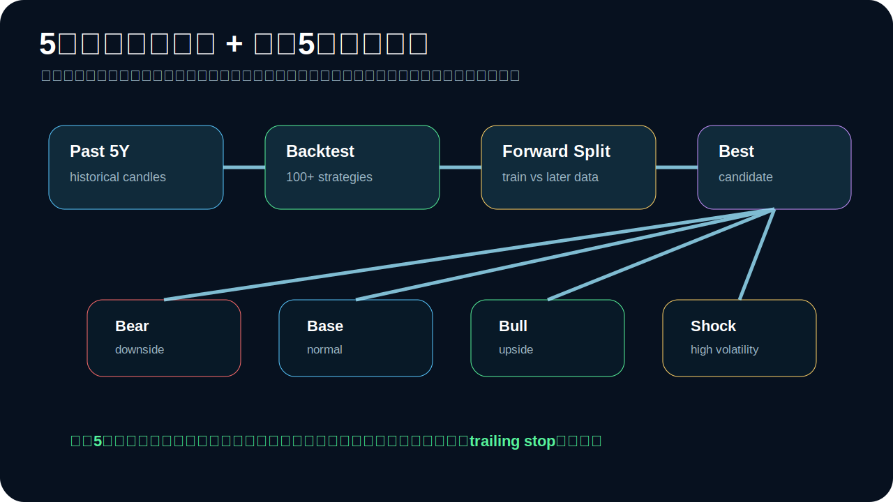

# Price Data and 5-Year Simulation / 価格取得と5年シミュレーション


## 現在、価格をどう取るのか

このリポジトリは、価格取得を3系統に分けています。

## 1. 大量銘柄の現在価格

大量の仮想通貨の現在価格は、CoinGeckoのマーケット一覧API系データを使う設計です。

実装:

```text
crypto_auto_trade/market_data.py
```

CLI:

```bash
python -m crypto_auto_trade.cli market-snapshot --vs-currency usd --pages 1 --per-page 250
```

保存先:

```text
data/market_snapshots/prices_YYYYMMDDTHHMMSSZ.json
```

Web UI:

```text
Fetch Prices ボタン
```

取得される主な項目:

- coin id
- symbol
- name
- current price
- market cap
- total volume
- 24h price change
- last updated

## 2. 取引所OHLCV

バックテストやリアルタイム検証で使うローソク足は、CCXT経由で取引所から取得できます。

実装:

```text
crypto_auto_trade/data.py
```

関数:

```text
fetch_live_ohlcv(exchange_id, symbol, timeframe, limit)
```

CLI例:

```bash
python -m crypto_auto_trade.cli realtime \
  --live-data \
  --exchange binance \
  --symbol BTC/USDT \
  --timeframe 1h \
  --strategy regime_guard \
  --trailing-stop-pct 0.05
```

## 3. 5年履歴の日足データ

5年シミュレーションでは、CoinGeckoのmarket chart range系データを日足ローソクに変換する設計です。

実装:

```text
crypto_auto_trade/market_data.py
```

関数:

```text
CoinGeckoClient.five_year_daily_candles(...)
market_chart_to_daily_candles(...)
```

ネットワークやAPI制限で取得できない場合でも、アプリ全体が止まらないようにサンプルデータへフォールバックします。

## 過去5年バックテスト



`simulate-five-years` は、対象コインごとに過去5年相当のローソク足を使って以下を記録します。

- 過去5年バックテスト
- train / forward split テスト
- Best Candidate 戦略選定
- trailing stop 発動回数
- max drawdown
- total return
- Sharpe-like score

CLI:

```bash
python -m crypto_auto_trade.cli simulate-five-years \
  --coin-ids bitcoin,ethereum,solana,ripple,binancecoin \
  --trailing-stop-pct 0.05 \
  --strategy-limit 20
```

実データ履歴を使う場合:

```bash
python -m crypto_auto_trade.cli simulate-five-years \
  --coin-ids bitcoin,ethereum \
  --live-history \
  --trailing-stop-pct 0.05
```

保存先:

```text
data/simulation_results/simulation_YYYYMMDDTHHMMSSZ.json
```

## 未来5年フォワードテストについて

未来5年の実価格は存在しません。

そのため、このリポジトリでは **未来5年フォワードテスト** を、実未来価格の予言ではなく、以下のような **シナリオ型フォワード・シミュレーション** として実装しています。

| scenario | 意味 |
|---|---|
| `bear` | 弱気・下落寄り |
| `base` | 標準ケース |
| `bull` | 強気・上昇寄り |
| `shock` | 急落・急騰が混ざる高ボラケース |

実装:

```text
crypto_auto_trade/market_data.py
```

関数:

```text
generate_synthetic_future_candles(seed_candles, years=5, scenario='base')
```

この関数は、過去データのリターン分布をもとに、将来5年分の日足シナリオを生成します。

## Web UI


画面に追加したボタン:

- `Fetch Prices`
- `5Y Simulation`

`Fetch Prices` は大量銘柄の現在価格を取得してJSON保存します。

`5Y Simulation` は指定コインに対して、過去5年バックテスト、forward split、未来5年シナリオをまとめて記録します。

## 注意

未来5年シミュレーションは利益予測ではありません。

目的は以下です。

- 戦略が極端な相場で壊れないかを見る
- trailing stop が防御として機能するかを見る
- bull / bear / shock の各ケースで比較する
- paper tradingへ進む前の耐久試験に使う

実売買に進む場合も、必ず小額・API withdrawals disabled・paper trading確認後にしてください。
