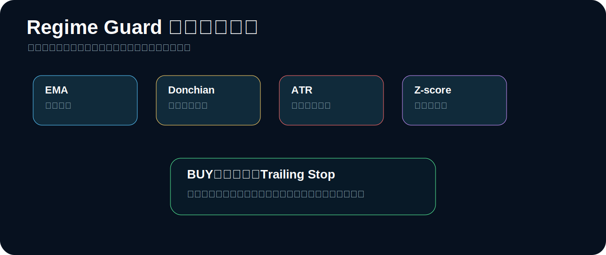

# Crypto Auto Trade


**Crypto Auto Trade** is a simple, visual crypto trading bot with selectable strategies, mandatory trailing stops after entry, backtesting, forward testing, real-time validation, paper trading, and guarded live trading.

> This is trading software, not a profit guarantee. The default workflow is **Backtest → Forward Test → Realtime Validate → Paper → Guarded Live**.

## What this bot does


1. You choose a strategy.
2. The bot generates BUY / SELL / HOLD signals.
3. If a BUY creates a position, the bot immediately starts tracking a trailing stop.
4. While a position exists, the stop follows the highest price after entry.
5. If price drops through the trailing stop, the bot exits.
6. Backtest, forward test, realtime validation, paper trading, and live trading all use the same strategy engine.

## Dashboard image


The dashboard is intentionally simple:

- strategy selector,
- symbol / timeframe / exchange inputs,
- trailing stop percentage input,
- Backtest / Forward Test / Realtime Validate buttons,
- metric cards,
- equity curve,
- latest signal and reason,
- strategy comparison table.

## Architecture


FastAPI serves the API and static dashboard. FastAPI supports mounting static files from a directory, which keeps the UI simple and reviewable.

## Setup

```bash
git clone https://github.com/univcorp2-ctrl/crypto-auto-trade.git
cd crypto-auto-trade
python -m venv .venv
source .venv/bin/activate
pip install -e '.[dev,web,live]'
pytest
python -m crypto_auto_trade.cli validate --iterations 200
python -m crypto_auto_trade.web
```

Open:

```text
http://127.0.0.1:8000
```

## Strategy selection



| Strategy | What it does | Best market | Main weakness | Exit protection |
|---|---|---|---|---|
| `regime_guard` | Detects trend/range/shock and trades only when conditions fit | Mixed markets | Conservative, may skip moves | Mandatory trailing stop + risk-off exits |
| `ema_cross` | Buys when fast EMA is above slow EMA | Clean trends | Whipsaw in ranges | Mandatory trailing stop |
| `donchian_trend` | Buys breakout above recent channel high | Strong breakouts | Fake breakouts | Mandatory trailing stop |
| `rsi_reversion` | Buys oversold RSI and exits on recovery | Range markets | Bad in persistent downtrend | Mandatory trailing stop + volatility exit |
| `bollinger_breakout` | Buys volatility expansion above upper band with trend filter | Expansion phases | Wick reversals | Mandatory trailing stop |

### `regime_guard` explained

`regime_guard` is the default strategy. It first asks: **what kind of market are we in?**

- **Trend up:** EMA confirms direction and price breaks a Donchian high.
- **Trend down:** bot stays flat.
- **Sideways:** bot allows only a small mean-reversion position.
- **Shock volatility:** bot exits or avoids entry.

A BUY is not enough by itself. Once a BUY creates a position, the trailing stop starts immediately.

### `ema_cross` explained

`ema_cross` is the simplest trend-following model.

- BUY when fast EMA is above slow EMA.
- EXIT when fast EMA falls below slow EMA or trailing stop is hit.

It is easy to understand, but it can lose during sideways chop.

### `donchian_trend` explained

`donchian_trend` waits for a breakout.

- BUY when price closes above the previous channel high.
- EXIT when price breaks down or trailing stop is hit.

It tries to catch momentum, but fake breakouts are the main risk.

### `rsi_reversion` explained

`rsi_reversion` is a mean-reversion strategy.

- BUY when RSI is oversold.
- EXIT when RSI recovers, volatility becomes dangerous, or trailing stop is hit.

It is not meant for strong downtrends.

### `bollinger_breakout` explained

`bollinger_breakout` waits for volatility expansion.

- BUY when price breaks above the upper Bollinger band and trend filter agrees.
- EXIT below the middle band or by trailing stop.

## Mandatory trailing stop


The bot always creates a trailing stop state after entry.

Example with `trailing_stop_pct = 5%`:

1. Bot buys at 100.
2. Price rises to 110.
3. Stop follows to 104.5.
4. Price rises to 120.
5. Stop follows to 114.
6. Price falls to 114 or below.
7. Bot exits.

## Commands

```bash
python -m crypto_auto_trade.cli list-strategies
python -m crypto_auto_trade.cli backtest --strategy regime_guard --trailing-stop-pct 0.05
python -m crypto_auto_trade.cli forward-test --strategy regime_guard --trailing-stop-pct 0.05
python -m crypto_auto_trade.cli validate --iterations 200 --trailing-stop-pct 0.05
python -m crypto_auto_trade.cli realtime --live-data --exchange binance --symbol BTC/USDT --timeframe 1h --strategy regime_guard --trailing-stop-pct 0.05
python -m crypto_auto_trade.cli paper-once --strategy regime_guard --trailing-stop-pct 0.05
```

## Guarded live trading

Live trading is locked unless all required environment variables exist:

```bash
export EXCHANGE_API_KEY='your_key'
export EXCHANGE_API_SECRET='your_secret'
export CRYPTO_AUTO_TRADE_LIVE_ACK='I_UNDERSTAND_THIS_CAN_LOSE_MONEY'
python -m crypto_auto_trade.cli live-once --strategy regime_guard --exchange binance --symbol BTC/USDT --timeframe 1h --quote-order-size 15 --trailing-stop-pct 0.05
```

Use API keys with withdrawals disabled and start with very small size.

## Security

Never commit or paste GitHub tokens, exchange keys, or secrets. If a token is exposed, revoke it and create a new one.

## License

MIT
