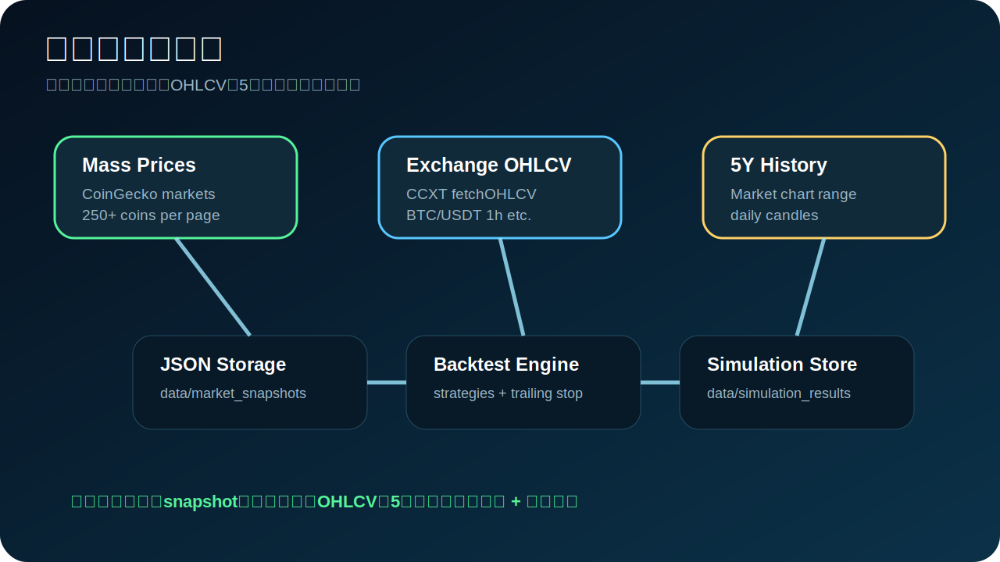
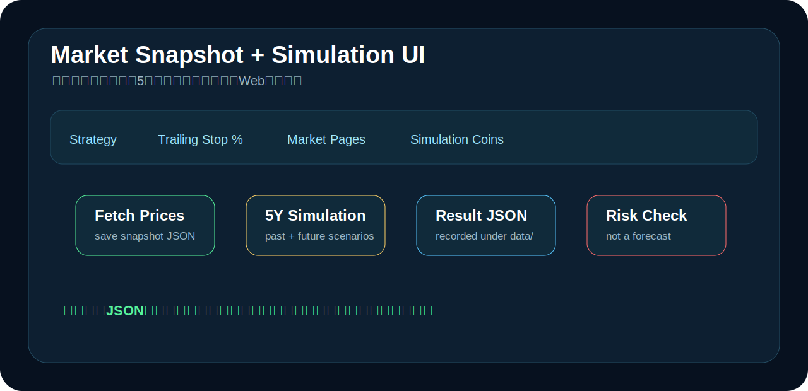

# Crypto Auto Trade


## まず見る場所

- **価格取得と5年シミュレーション:** [`PRICE_DATA_AND_SIMULATION.md`](PRICE_DATA_AND_SIMULATION.md)
- **100+戦略バリエーションの図解:** [`STRATEGY_VARIANTS.md`](STRATEGY_VARIANTS.md)
- **詳しい説明:** [`docs/strategy-variants-explained.md`](docs/strategy-variants-explained.md)
- **戦略一覧:** [`STRATEGIES.md`](STRATEGIES.md)
- **戦略コード本体:** `crypto_auto_trade/strategies.py`
- **大量現在価格取得:** `crypto_auto_trade/market_data.py`
- **5年シミュレーション:** `crypto_auto_trade/simulation.py`
- **必須トレーリングストップ:** `crypto_auto_trade/backtest.py`
- **日本向け取引所APIレジストリ:** `crypto_auto_trade/exchange_registry.py`

**Crypto Auto Trade** is a Japanese-user-oriented crypto auto-trading bot with:

- mass current crypto price snapshots,
- Japan exchange registry,
- public/private API connection preparation,
- 100+ selectable strategy variants,
- mandatory trailing stop after every entry,
- past 5Y backtest and future 5Y scenario simulation,
- backtest, forward test, real-time validation,
- paper trading and guarded live trading,
- simple dashboard UI.

> This is trading software, not a profit guarantee. The default workflow is **Price Snapshot → Backtest → Forward Test → 5Y Simulation → Paper → Guarded Live**.

## Price data and 5-year simulation



詳しい説明: [`PRICE_DATA_AND_SIMULATION.md`](PRICE_DATA_AND_SIMULATION.md)

大量銘柄の現在価格:

```bash
python -m crypto_auto_trade.cli market-snapshot --vs-currency usd --pages 1 --per-page 250
```

5年シミュレーション:

```bash
python -m crypto_auto_trade.cli simulate-five-years \
  --coin-ids bitcoin,ethereum,solana,ripple,binancecoin \
  --trailing-stop-pct 0.05 \
  --strategy-limit 20
```

実履歴を使う場合:

```bash
python -m crypto_auto_trade.cli simulate-five-years \
  --coin-ids bitcoin,ethereum \
  --live-history \
  --trailing-stop-pct 0.05
```

保存先:

```text
data/market_snapshots/
data/simulation_results/
```

未来5年は実価格が存在しないため、`bear` / `base` / `bull` / `shock` のシナリオ型フォワード・シミュレーションとして扱います。

## 100+ strategy variants: 図解


100+戦略バリエーションとは、**5つの基本戦略をパラメータ違いで100種類以上に展開し、同じ条件で比較できるようにしたもの**です。

詳しい説明:

- [`STRATEGY_VARIANTS.md`](STRATEGY_VARIANTS.md)
- [`docs/strategy-variants-explained.md`](docs/strategy-variants-explained.md)

## Japan exchange coverage


This repository keeps Japan-related venues in `crypto_auto_trade/exchange_registry.py` and separates them by API readiness.

Commands:

```bash
python -m crypto_auto_trade.cli list-exchanges
python -m crypto_auto_trade.cli list-api-ready-exchanges
python -m crypto_auto_trade.cli exchange-secrets --exchange bitflyer
python -m crypto_auto_trade.cli exchange-ticker --exchange bitflyer --symbol BTC_JPY
python -m crypto_auto_trade.cli exchange-ticker --exchange gmo_coin --symbol BTC_JPY
```

## 100+ strategy variants


Full strategy index: [`STRATEGIES.md`](STRATEGIES.md)

| Family | Variants | Purpose |
|---|---:|---|
| `regime_guard` | 18 | Market regime filter + defensive breakout/reversion |
| `ema_cross` | 24 | Trend following speed combinations |
| `donchian_trend` | 24 | Breakout lookback and position sizing variations |
| `rsi_reversion` | 24 | Mean-reversion threshold variations |
| `bollinger_breakout` | 24 | Volatility breakout window/multiple variations |

List every strategy:

```bash
python -m crypto_auto_trade.cli list-strategies
```

Pick the current best candidate from rolling validation:

```bash
python -m crypto_auto_trade.cli best-strategy --iterations 300 --trailing-stop-pct 0.05
```

## Dashboard image



The dashboard shows:

- strategy selector with 100+ options,
- API-ready exchange selector,
- market snapshot page count,
- simulation coin ids,
- trailing stop percentage,
- Fetch Prices,
- 5Y Simulation,
- Backtest / Forward Test / Realtime Validate / Compare All / Pick Best,
- equity curve,
- latest signal and stored JSON result path.

## Architecture


FastAPI serves the API and static dashboard.

## Mandatory trailing stop


The bot always creates a trailing stop state after entry.

## Setup

```bash
git clone https://github.com/univcorp2-ctrl/crypto-auto-trade.git
cd crypto-auto-trade
python -m venv .venv
source .venv/bin/activate
pip install -e '.[dev,web,live]'
pytest
python -m crypto_auto_trade.cli simulate-five-years --strategy-limit 20 --trailing-stop-pct 0.05
python -m crypto_auto_trade.web
```

Open:

```text
http://127.0.0.1:8000
```

## Security

Never commit or paste GitHub tokens, exchange keys, or secrets. If a token is exposed, revoke it and create a new one.

## License

MIT
