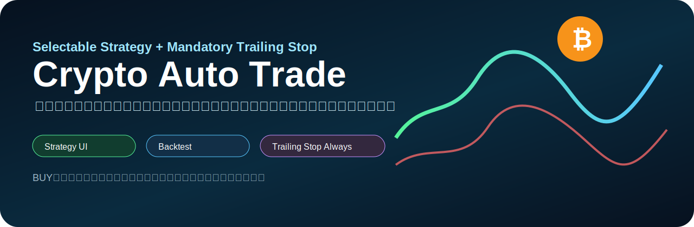
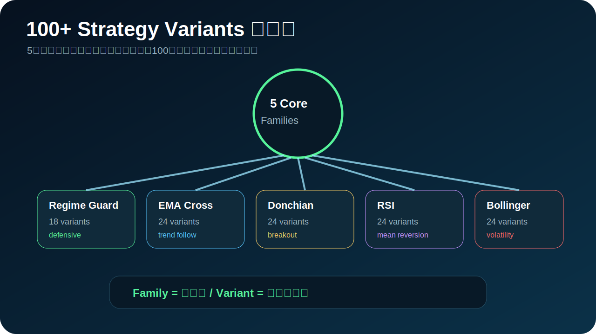
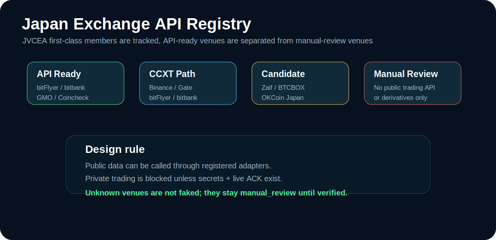
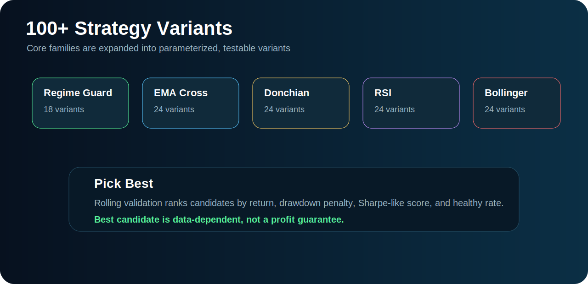
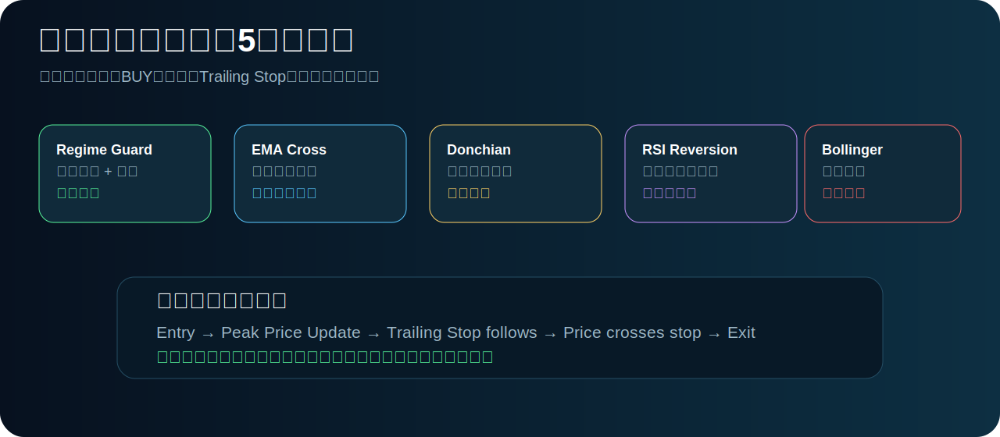
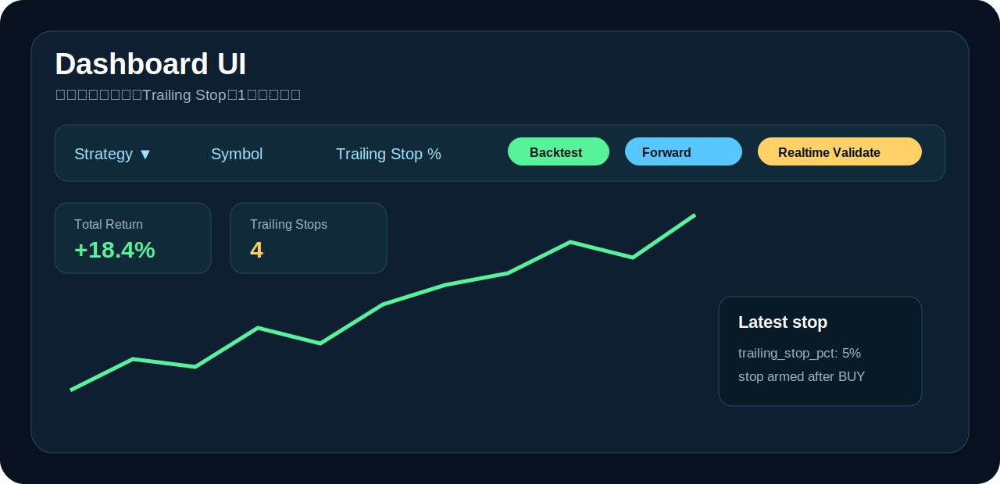
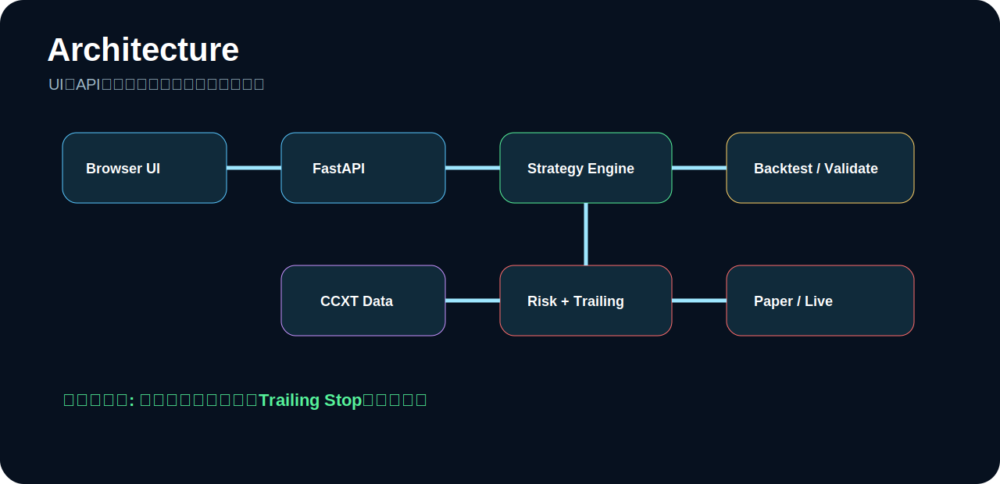
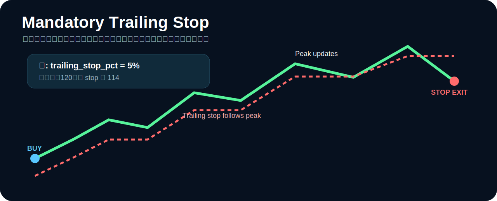

# Crypto Auto Trade



## まず見る場所

- **100+戦略バリエーションの図解:** [`STRATEGY_VARIANTS.md`](STRATEGY_VARIANTS.md)
- **詳しい説明:** [`docs/strategy-variants-explained.md`](docs/strategy-variants-explained.md)
- **戦略一覧:** [`STRATEGIES.md`](STRATEGIES.md)
- **戦略コード本体:** `crypto_auto_trade/strategies.py`
- **100種類以上の戦略バリエーション定義:** `crypto_auto_trade/strategy_variants.py`
- **必須トレーリングストップ:** `crypto_auto_trade/backtest.py`
- **日本向け取引所APIレジストリ:** `crypto_auto_trade/exchange_registry.py`

**Crypto Auto Trade** is a Japanese-user-oriented crypto auto-trading bot with:

- Japan exchange registry based on JVCEA/FSA style membership research,
- public/private API connection preparation,
- 100+ selectable strategy variants,
- mandatory trailing stop after every entry,
- backtest, forward test, real-time validation,
- paper trading and guarded live trading,
- simple dashboard UI.

> This is trading software, not a profit guarantee. The default workflow is **Backtest → Forward Test → Realtime Validate → Paper → Guarded Live**.

## 100+ strategy variants: 図解



100+戦略バリエーションとは、**5つの基本戦略をパラメータ違いで100種類以上に展開し、同じ条件で比較できるようにしたもの**です。

詳しい説明:

- [`STRATEGY_VARIANTS.md`](STRATEGY_VARIANTS.md)
- [`docs/strategy-variants-explained.md`](docs/strategy-variants-explained.md)

## Japan exchange coverage



JVCEA lists 32 first-class members and identifies categories such as crypto asset exchange business, derivatives business, electronic payment instruments, and funds transfer business. This repository keeps those venues in `crypto_auto_trade/exchange_registry.py` and separates them by API readiness.

Commands:

```bash
python -m crypto_auto_trade.cli list-exchanges
python -m crypto_auto_trade.cli list-api-ready-exchanges
python -m crypto_auto_trade.cli exchange-secrets --exchange bitflyer
python -m crypto_auto_trade.cli exchange-ticker --exchange bitflyer --symbol BTC_JPY
python -m crypto_auto_trade.cli exchange-ticker --exchange gmo_coin --symbol BTC_JPY
```

API-ready or candidate venues include:

- bitFlyer
- bitbank
- GMOコイン
- Coincheck
- Zaif
- BTCBOX
- Binance Japan / Binance API compatible path
- Gate Japan / Gate API compatible path
- OKCoin Japan adapter skeleton
- BitTrade adapter skeleton

Manual-review venues remain in the registry, but the bot does not pretend to trade them until an API is confirmed.

## 100+ strategy variants



Full strategy index: [`STRATEGIES.md`](STRATEGIES.md)

The bot includes 5 core families and 100+ generated variations:

| Family | Variants | Purpose |
|---|---:|---|
| `regime_guard` | 18 | Market regime filter + defensive breakout/reversion |
| `ema_cross` | 24 | Trend following speed combinations |
| `donchian_trend` | 24 | Breakout lookback and position sizing variations |
| `rsi_reversion` | 24 | Mean-reversion threshold variations |
| `bollinger_breakout` | 24 | Volatility breakout window/multiple variations |

List every strategy:

```bash
python -m crypto_auto_trade.cli list-strategies
```

Pick the current best candidate from rolling validation:

```bash
python -m crypto_auto_trade.cli best-strategy --iterations 300 --trailing-stop-pct 0.05
```

The selection score uses average return, Sharpe-like score, drawdown penalty, and healthy-rate. It is not a profit guarantee; it is a repeatable way to choose the strongest historical candidate under the current data and trailing stop setting.

## Strategy workflow



1. Choose a core strategy or one of 100+ variants.
2. Run backtest.
3. Run forward test.
4. Run 300+ rolling-window validations.
5. Use the Best candidate button or CLI.
6. Paper trade.
7. Only then consider guarded live trading.

## Dashboard image



The dashboard shows:

- strategy selector with 100+ options,
- API-ready exchange selector,
- symbol / timeframe / data source,
- trailing stop percentage,
- Backtest / Forward Test / Realtime Validate / Compare All / Pick Best,
- strategy count and exchange count,
- equity curve,
- latest signal and stop information.

## Architecture



FastAPI serves the API and static dashboard. FastAPI supports mounting static files from a directory, which keeps the UI simple and reviewable.

## Mandatory trailing stop



The bot always creates a trailing stop state after entry.

Example with `trailing_stop_pct = 5%`:

1. Bot buys at 100.
2. Price rises to 110.
3. Stop follows to 104.5.
4. Price rises to 120.
5. Stop follows to 114.
6. Price falls to 114 or below.
7. Bot exits.

## Setup

```bash
git clone https://github.com/univcorp2-ctrl/crypto-auto-trade.git
cd crypto-auto-trade
python -m venv .venv
source .venv/bin/activate
pip install -e '.[dev,web,live]'
pytest
python -m crypto_auto_trade.cli validate --iterations 300 --trailing-stop-pct 0.05
python -m crypto_auto_trade.web
```

Open:

```text
http://127.0.0.1:8000
```

## Commands

```bash
python -m crypto_auto_trade.cli list-strategies
python -m crypto_auto_trade.cli list-api-ready-exchanges
python -m crypto_auto_trade.cli best-strategy --iterations 300 --trailing-stop-pct 0.05
python -m crypto_auto_trade.cli backtest --strategy regime_guard --trailing-stop-pct 0.05
python -m crypto_auto_trade.cli forward-test --strategy regime_guard --trailing-stop-pct 0.05
python -m crypto_auto_trade.cli realtime --live-data --exchange binance --symbol BTC/USDT --timeframe 1h --strategy regime_guard --trailing-stop-pct 0.05
python -m crypto_auto_trade.cli paper-once --strategy regime_guard --trailing-stop-pct 0.05
```

## 勝てるか検証 (Profitability verdict)

ダッシュボードの **「勝てるか検証」** ボタン、または API で、登録済み全戦略
バリエーションが「勝てるか（収益を出せるか）」を判定します。ローリング検証・
全戦略バックテスト・最良候補のフォワードテストを組み合わせ、
`win_likely` / `marginal` / `lose_likely` の verdict を返します。

```bash
curl 'http://127.0.0.1:8000/api/verify-profitability?iterations=300&trailing_stop_pct=0.05'
```

これは過去データ・サンプルに基づく判定であり、将来の利益を保証するものでは
ありません。

## Cloudflare Tunnel で公開

FastAPI (Python) は Cloudflare Workers/Pages では直接動かないため、ローカルの
ダッシュボードを **Cloudflare Tunnel (`cloudflared`)** で公開します。詳細は
[`docs/cloudflare-tunnel.md`](docs/cloudflare-tunnel.md)。

```bash
pip install -e '.[web]'
# cloudflared を導入後:
scripts/cloudflare_tunnel.sh
```

クイックトンネルなら Cloudflare アカウント不要で
`https://<...>.trycloudflare.com` の公開 URL が払い出されます。公開時は認証が
ないため、常設する場合は Cloudflare Access 等で保護してください。

## Cloudflare 本番デプロイ（Workers + Static Assets）

常設の本番運用には、エンジンを TypeScript に移植した **Cloudflare Worker**
（[`worker/`](worker)）を使います。静的ダッシュボード＋API を Cloudflare 内で完結
させる「Pages+Workers」構成で、`workers.dev` の公開 URL が得られます。バックテスト
結果は Python 実装と6桁一致することをテストで検証しています。詳細は
[`docs/cloudflare-pages-workers.md`](docs/cloudflare-pages-workers.md)。

```bash
cd worker && npm install
export CLOUDFLARE_API_TOKEN=...      # コミット・直書き禁止。環境変数で渡す
export CLOUDFLARE_ACCOUNT_ID=...
./deploy.sh
```

## Guarded live trading

Live trading is locked unless all required environment variables exist:

```bash
export EXCHANGE_API_KEY='your_key'
export EXCHANGE_API_SECRET='your_secret'
export CRYPTO_AUTO_TRADE_LIVE_ACK='I_UNDERSTAND_THIS_CAN_LOSE_MONEY'
python -m crypto_auto_trade.cli live-once --strategy regime_guard --exchange binance --symbol BTC/USDT --timeframe 1h --quote-order-size 15 --trailing-stop-pct 0.05
```

Use API keys with withdrawals disabled and start with very small size.

## Research sources

The implementation notes are summarized in `docs/japan-exchanges.md`. The registry should be refreshed periodically because exchange registration and API availability can change.

## Security

Never commit or paste GitHub tokens, exchange keys, or secrets. If a token is exposed, revoke it and create a new one.

## License

MIT
