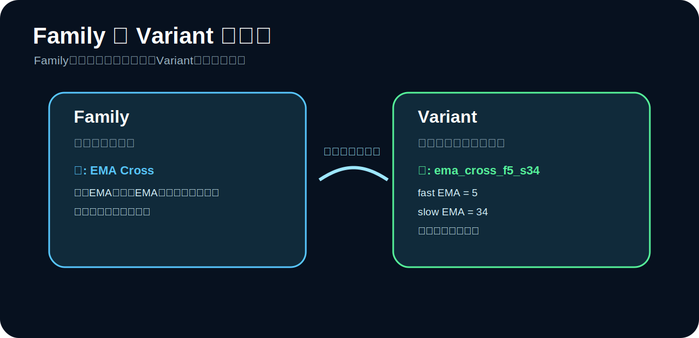
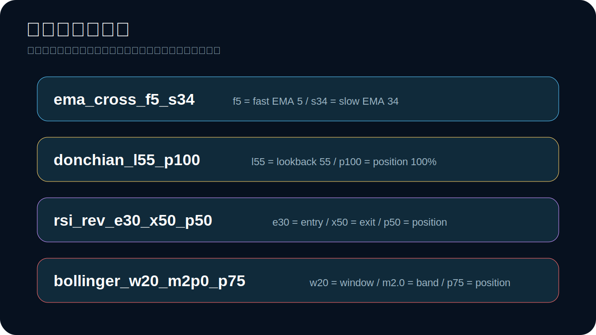
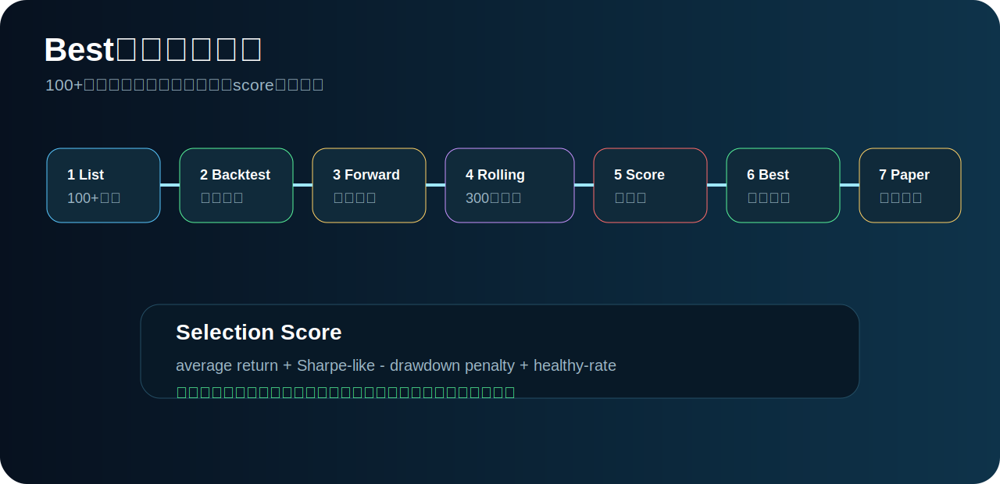

# 100+ Strategy Variants / 100種類以上の戦略バリエーション説明


このページは、READMEで分かりにくかった **「100種類以上の戦略バリエーション定義」** を、画像と文章で説明するための入口です。

## 一言でいうと

**100種類以上の戦略バリエーション** とは、

> 5つの基本戦略を、パラメータ違いで100種類以上に展開し、同じ条件で比較・検証できるようにしたもの

です。

つまり、100個の完全に別々のロジックを手書きしているわけではありません。

```text
5つの基本戦略ファミリー
  ×
パラメータ違い
  =
100種類以上の検証可能な戦略候補
```

## なぜこの形にしたか

完全に別々の100個の戦略を手書きすると、以下の問題が出ます。

- どの戦略が何をしているのか分からなくなる
- バグが入りやすい
- 比較条件が揃わなくなる
- 改修時に100箇所を直す必要がある

そこで、このリポジトリでは以下の構造にしています。

```text
基本戦略 = 考え方
バリエーション = 設定値違い
```

## 5つの基本戦略ファミリー



| ファミリー | 意味 | バリエーション数 | 例 |
|---|---|---:|---|
| `regime_guard` | 相場判定 + 防御 | 18 | `regime_guard_s80_b55_atr8` |
| `ema_cross` | EMA順張り | 24 | `ema_cross_f5_s34` |
| `donchian_trend` | 高値ブレイク | 24 | `donchian_l55_p100` |
| `rsi_reversion` | RSI逆張り | 24 | `rsi_rev_e30_x50_p50` |
| `bollinger_breakout` | ボラ拡大 | 24 | `bollinger_w20_m2p0_p75` |

合計で100種類以上になります。

## 命名規則の読み方



### `ema_cross_f5_s34`

```text
ema_cross = EMA Cross系
f5        = fast EMA 5
s34       = slow EMA 34
```

意味:

> 5本EMAと34本EMAを使う、反応が速めのEMA順張り戦略

### `donchian_l55_p100`

```text
donchian = Donchian breakout系
l55      = lookback 55本
p100     = position 100%
```

意味:

> 過去55本の高値を抜けたら、100%ポジションで乗るブレイクアウト戦略

### `rsi_rev_e30_x50_p50`

```text
rsi_rev = RSI reversion系
e30     = entry RSI 30
x50     = exit RSI 50
p50     = position 50%
```

意味:

> RSIが30以下で50%だけ入り、RSIが50まで戻ったら逃げる平均回帰戦略

### `bollinger_w20_m2p0_p75`

```text
bollinger = Bollinger breakout系
w20       = window 20
m2p0      = band multiplier 2.0
p75       = position 75%
```

意味:

> 20本ボリンジャーバンドの2σ上抜けで、75%ポジションを取るボラ拡大戦略

## どうやって勝てそうなものを選ぶか



このリポジトリでは、次の流れで選びます。

1. 100+戦略を一覧化
2. 同じトレーリングストップ条件でBacktest
3. Forward Testで過学習っぽさを見る
4. rolling-window validationを300回以上実行
5. return / drawdown / Sharpe-like / healthy-rateでscore化
6. Best Candidateを選ぶ
7. paper tradingで実運用前検証
8. 実売買はACKとAPI keysが揃うまでブロック

Best候補を選ぶコマンド:

```bash
python -m crypto_auto_trade.cli best-strategy --iterations 300 --trailing-stop-pct 0.05
```

## 実装場所

| 内容 | ファイル |
|---|---|
| 100+バリエーション定義 | `crypto_auto_trade/strategy_variants.py` |
| 実際の戦略ロジック | `crypto_auto_trade/strategies.py` |
| Best候補選定 | `crypto_auto_trade/validation.py` |
| 必須トレーリングストップ | `crypto_auto_trade/backtest.py` |
| 画面/API | `crypto_auto_trade/web.py` |

## UIで見る

```bash
python -m crypto_auto_trade.web
```

ブラウザ:

```text
http://127.0.0.1:8000
```

画面上部の `Strategy` セレクトボックスに、100種類以上の候補が表示されます。

## 大事な安全ルール

どのバリエーションを選んでも、BUY後は必ずトレーリングストップが有効になります。

```text
BUY → mandatory trailing stop armed
価格がstop到達 → mandatory trailing stop hit
```

これは全戦略共通の防御ルールです。
